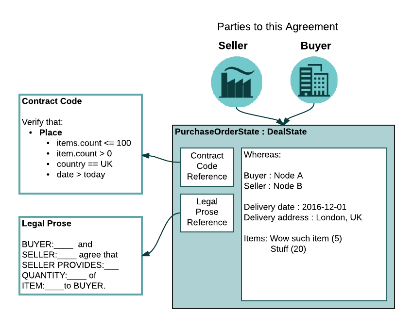

Developing on Corda
===================
Before reading this tutorial, we suggest you begin with reading:

* `CorDapps background <creating-a-cordapp>`_
* `CorDapp tutorial <tutorial-cordapp>`_

Those pages should provide you with the pre-requisite knowledge around the mechanics of the Corda plugin system as well
as how to build and run your CorDapps locally.

This tutorial is more concerned with the design process of building CorDapps - we will walk you through the design
considerations for the Example CorDapp and along the way define the various classes which implement it.

.. note:: This tutorial is constantly evolving as we add additional functionality to Corda.

Now, let’s get down to business! We are going to run through the thinking behind creating the Example CorDapp from
scratch. You should be able to re-use most of these concepts when building your own CorDapps.

To easiest way to build your CorDapp is to follow a prescribed series of steps, outlined below:

1. **Scenario:**

    * What is the nature of the scenario being modelled?
    * What real-world data, agreements or instruments are involved?
    * What is the typical life-cycle of the above?

2. **Parties:**

    * How many parties are involved?
    * What are their respective roles?

3. **Data:**

    * What data do the parties defined above need to come to consensus about?
    * How many different types of data are involved in the scenario?

4. **Process:**

    * How does the data, defined above, evolve over time?
    * At what points does the data evolve?
    * Which parties are involved at each stage?

5. **Consensus:**

    * What constitutes valid vs invalid data?
    * How do the parties reach consensus at each stage of

6. **Interfaces:**

    * How will the various parties defined above interact with the CorDapp?

The scenario
------------

In this case the scenario to be modelled is the purchase order cycle which goes something like:

1. Determine need to purchase something.
2. Issue purchase order to supplier.
3. Receive good from supplier.
4. Inspect goods. Match Goods delivered note to purchase order.
5. Receive and enter invoice into system.
6. Match invoice with purchase order and goods delivered note.
7. Approve payment.
8. Make payment.
9. Reconcile payment.

To reduce complexity, the scope will be significantly reduced to the issuing purchase order step only. Typically a
customer will submit a request to purchase some items to a supplier by way of a purchase order. It is expected that if
the customer has has passed sufficient credit checks and the items requested are in stock, then the supplier will fulfill
the purchase order by shipping the items to the customer.

Parties involved
----------------

In this scenario, the only parties involved are:

* The Buyer who submits purchase orders.
* The Seller who receives and fulfills purchase orders.

It will be assumed that the:

* buyer and seller already have a trading relationship
* buyer has passed the sellers credit requirements
* seller has the requested items in stock

As two nodes are required to represent the buyer and the seller as well as an additional node to act as the Notary
service and the Network Map Service.

Data
----

The data which the buyer and seller must reach consensus over is the purchase order instrument. As this is a simple
example, much of the associated detail around the purchase order can be hand-waved and distilled down to some basic
properties:

.. sourcecode::

    Purchase Order:
        Purchase Order Number
        Buyer Party
        Seller Party
        Delivery Date
        Delivery Address:
            City
            Country
        Items

    Items:
        Name
        Amount

here is a one-to-many relationship between purchase orders and items. As such, the following data classes can be defined
in Kotlin:

.. sourcecode:: kotlin

    data class Item(val name: String, val amount: Int)

    data class Address(val city: String, val country: String)

    data class PurchaseOrder(val orderNumber: Int,
                             val deliveryDate: Date,
                             val deliveryAddress: Address,
                             val items: List<Item>)

This code is defined in ``src/main/kotlin/com/example/model/PurchaseOrder.kt``. This information can be encapsulated
within a ``ContractState``, defined as follows:

.. sourcecode:: kotlin

    interface ContractState {
        /**
         * An instance of the contract class that will verify this state.
         */
        val contract: Contract

        /**
         * A _participant_ is any party that is able to consume this state in a valid transaction.
         */
        val participants: List<CompositeKey>
    }

For more information on ``ContractState``, see `the core types documentation <key-concepts-core-types.rst>`_. For the
example CorDapp a ``DealState`` is used which represents an agreement between two or more parties and is intended to
simplify implementing generic flows that manipulate many agreement types. The complete ``PurchaseOrderState`` looks like:

.. sourcecode:: kotlin

    data class PurchaseOrderState(val po: PurchaseOrder,
                                  val buyer: Party,
                                  val seller: Party,
                                  override val contract: PurchaseOrderContract,
                                  override val linearId: UniqueIdentifier = UniqueIdentifier(po.orderNumber.toString())):
            DealState {
        /** Another ref field, for matching with data in external systems. In this case the external Id is the po number. */
        override val ref: String = linearId.externalId!!
        /** List of parties involved in this particular deal */
        override val parties: List<Party> = listOf(buyer, seller)

        /**
         * This returns true if the state should be tracked by the vault of a particular node. In this case the logic is
         * simple; track this state if we are one of the involved parties.
         */
        override fun isRelevant(ourKeys: Set<PublicKey>): Boolean {
            val partyKeys = parties.flatMap { it.owningKey.keys }
            return ourKeys.intersect(partyKeys).isNotEmpty()
        }

        /**
         * Helper function to generate a new Issue() purchase order transaction. For more details on building transactions
         * see the API for [TransactionBuilder] in the JavaDocs.
         *
         * https://docs.corda.net/api/net.corda.core.transactions/-transaction-builder/index.html
         * */
        override fun generateAgreement(notary: Party): TransactionBuilder {
            return TransactionType.General.Builder(notary)
                    .withItems(this, Command(PurchaseOrderContract.Commands.Place(), parties.map { it.owningKey }))
        }

        /** The public keys of party that is able to consume this state in a valid transaction. */
        override val participants: List<CompositeKey> = parties.map { it.owningKey }
    }

The state contains some additional metadata:

* ``Party`` objects for the buyer and seller.
* A link to the ``PurchaseOrderContract`` code.
* Some implemented properties as mandated by the ``DealState`` which can be skipped over for now.
* The ``generateAgreement()`` method allows easy creation of a transaction that gives rise to the to a ``PurchaseOrderState``.
* ``isRelevant()`` is used by Corda to ascertain if this is a state that should be tracked by the vault, i.e. whether the node
calling ``isRelevant()`` has rights or obligations arising from this ``ContractState``.

At this stage, the data which the parties in this scenario are to reach consensus over, is defined. The next step is to define
the rules which determine what constitutes a valid purchase order.

Process
-------

A discussion of contract code. What clauses and commands do we need to implement.

:width: 600

Consensus
How do the parties reach consensus? For the buyer an the seller to reach consensus they: * Both have to see the proposed purchase order. * Validate the proposed purchase order. * Sign the purchase order. * Validate the counter-part’s signature. * Notarise the purchase order.

All the above happens by passing objects from node to node using the FLow framework. WIP. Some chat about flow sequence diagrams and an example flow diagram based on the ExampleFlow. We end up with signed transactions when all teh flows are complete. how will the parties interact with the Building your state A brief discussion of state interface choice. Code samples to implement the data model and state. Building the contract Code samples - discussion of clauses required. Link to clauses and contracts docs. Building the flows How to build a flow from scratch. An a note on services. We need to set up a listener for msgs on the wire. Building the interfaces How to build the APIs for users to interact with the CorDapp. Pulling it all together We need to sub-class CordaPluginRegistry.
